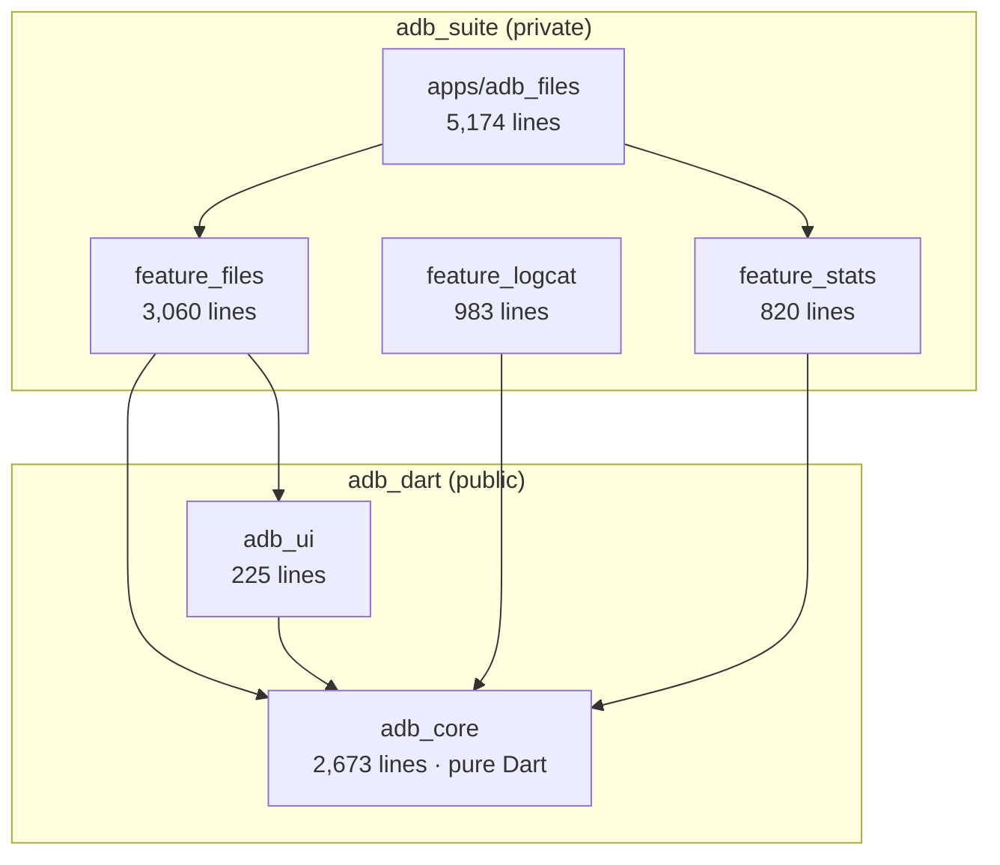

# Orientation

Everything about this project in one file: what it is, where it lives, how the
pieces fit, and the traps that cost real debugging time.

> Scope note: this describes **two sibling repos**. Each has its own `README.md`
> with per-repo detail. This file is the map across both.

---

## The 60-second version

You are building **Finder for Android devices** — desktop apps that browse and
manage an Android phone over ADB, plus the reusable layers underneath.

The distinguishing decision: **there is no `Process.run('adb', …)` anywhere.**
`adb_core` speaks the ADB wire protocol over a socket directly, so it returns
`mode`/`size`/`mtime` as integers and real exit codes, instead of scraping
stdout that changes between Android versions.

One app ships today: **`adb_files`**, a desktop file manager with tabs, drag and
drop, trash, in-place preview of media and documents, and connection over both
USB and Wi-Fi. Two more feature packages (`feature_logcat`, `feature_stats`)
are built and tested but not yet composed into their own app.

| | |
|---|---|
| **Languages** | Dart / Flutter, plus Swift for macOS native bits |
| **Targets** | macOS (primary), Windows, Linux, iOS/iPad (limited) |
| **Code** | ~12,940 lines of library code, ~3,070 of tests |
| **Tests** | **275 passing** — 67 + 16 + 65 + 40 + 32 + 55 |
| **License** | MIT, holder "Venu Gopal" |

---

## Where everything lives

```
<workspace>/            ← any parent directory; currently ~/Developer/abd_main
├── adb_dart/          ← PUBLIC repo: the protocol layer
│   ├── packages/adb_core/     pure Dart ADB client, no Flutter
│   └── packages/adb_ui/       shared Flutter widgets + formatters
│
└── adb_suite/         ← PRODUCT repo: features and shipping apps
    ├── packages/feature_files/    file management (service + UI)
    ├── packages/feature_logcat/   log streaming (service + UI)
    ├── packages/feature_stats/    CPU/memory/battery (service + UI)
    └── apps/adb_files/            the shipping desktop app
```

**What matters is that the two repos are siblings, not where that pair lives.**
`pubspec_overrides.yaml` reaches the protocol layer as `../adb_dart/...`,
relative to `adb_suite`. Moving the whole workspace is therefore safe; moving
one repo out from beside the other is what breaks the build. Paths below are
written relative to the workspace root for that reason — see
[Local setup](#local-setup).

> A third directory, `adb ` — note the **trailing space** — sits beside them.
> It is an abandoned earlier single-package version of this project
> (`lib/main.dart`, `lib/adb/`, `lib/features/`, last touched Dec 2025). It is
> not part of the build and nothing depends on it. The trailing space is why
> tooling that defaults its working directory to `.../adb` lands somewhere
> unexpected instead of failing outright.

### Repo identity

| | `adb_dart` | `adb_suite` |
|---|---|---|
| GitHub | `developer180527/adb_dart` | `developer180527/adb_suite` |
| Visibility | public | private |
| Contains | protocol + shared UI | features + apps |
| Versioned by | git tags (`v0.4.0`) | app version in pubspec |

**Why two repos.** The protocol layer is generally useful and publishable; the
product is not. Splitting them keeps the public surface small and forces the
dependency direction to stay honest.

---

## How the layers depend on each other



**Dependencies point one way only.** Product depends on protocol, never the
reverse. `adb_core` has no Flutter dependency at all, which is what lets it be
tested with plain `dart test` and reused outside Flutter.

A feature package owns **both** its service and its widgets, and knows nothing
about which app hosts it. Adding or splitting an app is a pubspec change, not a
refactor. `feature_logcat` currently has no host app — that is the intended
state, not an oversight.

---

## Layer by layer

### `adb_core` — the protocol client

`adb_dart/packages/adb_core/lib/src/`

Two transports implement one `AdbTransport` interface:

| Transport | Path | How it works | Status |
|---|---|---|---|
| **Host** | `transport/host/` | Talks to the local `adb` server on TCP 5037 | Works, primary |
| **Direct** | `transport/direct/` | Speaks the device protocol itself — legacy `AUTH`, or `STLS` + TLS 1.3 | Works, verified against hardware |

*Host* is what desktop uses. It requires the `adb` binary. *Direct* needs only a
socket, which is what makes an iOS/iPad build possible at all, since iOS cannot
spawn processes.

**The direct transport speaks two dialects, chosen by the device.** A legacy
`adb tcpip 5555` listener answers a cleartext `CNXN` with `AUTH` and the whole
session stays in the clear. An Android 11+ *Wireless debugging* listener answers
with `STLS`; the version is echoed back, the socket upgrades to TLS 1.3 carrying
a client certificate, and adbd authenticates the host by the **public key in
that certificate** rather than by an `AUTH` signature. `isSecure` says which
happened, and `peerCertificate` holds the device's certificate for pinning —
with no CA anywhere in the design, pinning is the only impersonation check
available.

Both paths are verified against a Galaxy A71 on Android 13: shell, sync listing
and a push/pull round trip over each.

```
adb_session.dart              top-level entry point
models/                       AdbDevice, AdbFileEntry, exceptions, parsers
services/
  shell_service.dart          shell v2 framing (1 id byte + 4-byte LE length)
  sync_service.dart           file push/pull: LIST/LIS2/DENT/DNT2/STAT/RECV/SEND
  remote_file.dart            range reads — the trick behind preview-without-download
transport/
  host/host_protocol.dart     4-hex length framing, OKAY/FAIL
  host/adb_binary.dart        locates the adb executable
  direct/adb_auth_key.dart    RSA-2048 PKCS#1 v1.5 signing, Android RSAPublicKey struct
  direct/adb_tls_identity.dart  PKCS#8 key + self-signed X.509 for the TLS path
  direct/adb_message.dart     24-byte header, magic = command ^ 0xFFFFFFFF
  direct/direct_connection.dart  CNXN/AUTH, the STLS upgrade, stream multiplexing
util/byte_reader.dart         resumable TCP framing
util/posix_shell.dart         shell quoting
```

**Start here:** `adb_session.dart`, then `services/sync_service.dart`.

`adb_tls_identity.dart` assembles DER by hand from pointycastle's ASN.1
primitives, because Dart has no X.509 writer. That is mechanical rather than
clever — the structures are fixed by RFC 5280 and PKCS#1 — but "looks right" is
not a standard for DER, so the tests check the output against **OpenSSL**:
parse, verify the signature over the TBS bytes, match the certificate modulus
to the key, and hand the pair to a `SecurityContext`.

`example/` holds runnable scripts against a real device — `smoke.dart`,
`integration.dart`, `remote_probe.dart`, `direct_spike.dart`, plus
`stls_probe.dart` (asks a port whether it answers `AUTH` or `STLS`) and
`tls_spike.dart` (the TLS handshake on its own). These need hardware and are
excluded from CI.

**Testing the wireless protocol without a network.** `adb forward tcp:6556
tcp:<device-port>` tunnels a device TCP port over USB, so `127.0.0.1:6556`
reaches adbd's own listener and the entire wireless handshake — STLS included —
can be exercised from a laptop with no route to the phone. This is how the TLS
transport was developed and verified while the router was blocking every direct
connection.

### `adb_ui` — shared Flutter bits

`adb_dart/packages/adb_ui/lib/src/` — only two files:
`device_picker.dart` and `formatters.dart` (`formatBytes`, `formatPercent`).
Deliberately thin; most UI belongs to a feature package.

### `feature_files` — the biggest feature

`adb_suite/packages/feature_files/lib/src/`

```
file_service.dart             listing, delete, rename, mkdir, read/write text
file_browser_controller.dart  navigation, selection, sort state
directory_walk.dart           recursive traversal
transfer_manager.dart         queued push/pull with progress
trash_service.dart            recoverable delete (moves, not unlinks)
remote_file_server.dart       local HTTP bridge — lets players stream device files
preview/                      preview_kind (type sniffing), controller, view
widgets/file_browser.dart     the main list/grid
models/                       DirectoryListing, FileAction, FileSort
remote_path.dart              POSIX path maths for device paths
```

**The interesting design:** `remote_file_server.dart` + `RemoteFile` range reads
mean a 2 GB video previews instantly. A local HTTP server translates byte-range
requests into targeted device reads, so the media player streams rather than
waiting for a full download.

### `feature_logcat` and `feature_stats`

Same shape: parsers, a service, models, one widget. `feature_logcat`'s
`log_ring_buffer.dart` keeps memory flat under sustained log volume.
`feature_stats` parses `dumpsys`/`/proc` output into typed CPU, memory, and
battery models. Both fully tested; `feature_logcat` has no host app yet.

### `adb_files` — the shipping app

`adb_suite/apps/adb_files/`

```
lib/
  main.dart                   entry; initialises media_kit + pdfrx, loads settings
  build_info.dart             which build is running (see Versioning)
  theme.dart                  neutral chrome, green accent from the icon
  screens/
    connect_screen.dart       device selection, plus the Wi-Fi connect/pair sheet
    disconnected_screen.dart  the app skeleton shown with no device attached
    browser_screen.dart       the main window
    settings_view.dart        appearance, preview cache, About — opens in a tab
  state/
    connection_controller.dart
    wireless_reply.dart       reads success out of adb's prose replies
    tabs_controller.dart      tabs incl. the settings tab
    app_settings.dart         persisted prefs (JSON, no plugin)
    app_options.dart          command-line args — used by tab tear-off
  widgets/
    browser_toolbar.dart      shared by the live window and the skeleton
    sidebar.dart, tab_bar.dart, drag_drop.dart, transfer_panel.dart
    media_viewer.dart         real audio/video via media_kit/libmpv
    document_viewer.dart      PDF via pdfrx/PDFium
    native_menu.dart          real NSMenu on macOS via method channel

macos/Runner/MainFlutterWindow.swift    window geometry, argv, NSMenu channel
tool/apply_icon.dart          regenerates icons for every platform
tool/release.sh               builds + packages a release
tool/README.md                icon and release documentation
Assets/                       icon sources (.icon bundle + 1024 PNG)
```

**Start here:** `main.dart` → `screens/browser_screen.dart`.

Desktop-class behaviours worth knowing: Cmd-T tabs, Cmd-N windows, Chrome-style
**drag a tab out to make a new window** (implemented by relaunching with
geometry args — see `app_options.dart` and the Swift file), native save panels,
and drag-and-drop to Finder using lazy virtual files so the download happens on
drop.

#### The window with no device

`DisconnectedScreen` renders the full chrome — sidebar, toolbar, tab strip,
status bar — inert, with the connect flow where the file list goes. A
full-window takeover made the app read as not yet started, and swapping whole
layouts meant the window rearranged itself whenever a cable was nudged.

It is **not a mock**: it builds the same `Sidebar` and `BrowserToolbar` the live
window builds, handed nulls instead of a session. Every control already derived
its `onPressed` from state that is absent without a device, so nothing needed a
parallel "disabled" flag — and a button added to the toolbar cannot appear in
one window and not the other. `BrowserScreen` still requires a live session and
was left alone; threading nullability through it and `TabsController` would have
been a large refactor of working code for no visible gain.

#### Connecting

| Route | Transport | Encrypted | Where |
|---|---|---|---|
| USB | host server, auto-detected | n/a | everywhere with a local adb |
| **Wi-Fi, paired** | host server: `host:pair` then `host:connect` | yes | desktop |
| **Wi-Fi, TLS** | `DirectAdbConnection`, `STLS` + client certificate | **yes** | iOS/iPad |
| Wi-Fi, legacy | `DirectAdbConnection`, `AUTH` over `adb tcpip 5555` | **no** | iOS/iPad, first-time setup only |

Desktop wireless deliberately goes through the **local adb server**, not the
direct transport: the server already implements the Android 11+ pairing
handshake, and a device connected that way flows through the existing
`trackDevices()` machinery like any other. It needed no `adb_core` change at
all, because `HostTransport.query()` is public — which is what kept this from
turning into a protocol release and a tag bump (see the cross-repo gotchas).

Android splits pairing and connecting across **two different ports**: pairing
runs on a port that changes every time the pairing dialog is opened, connecting
on a stable one. Conflating them is the usual reason wireless "does not work",
so the dialog separates them and says so.

**The iPad flow has a one-time step that cannot be skipped.** Android's pairing
code exchange is SPAKE2 over TLS and needs a desktop adb server, which iOS
cannot run — so a fresh identity has no way to become trusted from the Wireless
debugging screen alone. Instead the device is taught to trust the app **once**
over the legacy port (`adb tcpip 5555`, accept the on-device prompt), after
which the same key is accepted by the TLS listener and the plaintext port can be
closed again with `adb usb`. That the legacy authorisation carries over to TLS
is the thing that makes an iPad build viable without implementing SPAKE2, and it
was confirmed against hardware rather than assumed.

The address screen therefore leads with the Wireless debugging port and keeps
the legacy one behind a "First time with this device?" disclosure. It also
refuses to connect when the port field is empty: defaulting a missing port to
5555 would silently swap the encrypted connection the screen promises for a
plaintext one.

`isSessionEncrypted` is surfaced as a **"Not encrypted" badge in the sidebar,
and only when false**. `true` stays silent — a reassuring badge on every secure
session trains people to stop reading that row — and `null`, the adb-server
case where the server negotiates TLS without reporting it, stays silent too,
since warning there would fire on every USB session and teach users to dismiss
it.

---

## Local setup

Clone both into one parent directory. The parent's name and location do not
matter; being siblings does. On this machine that parent is
`~/Developer/abd_main`.

```bash
cd <workspace>
git clone https://github.com/developer180527/adb_dart.git
git clone https://github.com/developer180527/adb_suite.git
```

`adb_suite/pubspec_overrides.yaml` (**gitignored**, already present on this
machine) redirects `adb_core`/`adb_ui` to the sibling checkout so edits are live:

```yaml
dependency_overrides:
  adb_core:
    path: ../adb_dart/packages/adb_core
  adb_ui:
    path: ../adb_dart/packages/adb_ui
```

The committed pubspecs pin a **git tag** instead, so CI and fresh clones are
reproducible. **This split is the single biggest source of "works locally, fails
in CI"** — see the gotchas below.

```bash
cd adb_suite/apps/adb_files
flutter pub get
flutter run -d macos          # needs `adb` on PATH and a device with USB debugging
```

Run everything, from the workspace root. Each line is a subshell, so one
failure does not leave you in the wrong directory for the next:

```bash
(cd adb_dart/packages/adb_core        && dart test)     # 67
(cd adb_dart/packages/adb_ui          && flutter test)  # 16
(cd adb_suite/packages/feature_files  && flutter test)  # 65
(cd adb_suite/packages/feature_logcat && flutter test)  # 40
(cd adb_suite/packages/feature_stats  && flutter test)  # 32
(cd adb_suite/apps/adb_files          && flutter test)  # 55
```

---

## Versioning and releases

Nothing is hand-edited per build:

| Part | Source |
|---|---|
| `0.1.0` | `version:` in `apps/adb_files/pubspec.yaml` |
| build number | `git rev-list --count HEAD` — advances every commit |
| commit hash | `--dart-define=GIT_COMMIT`, compiled in |
| dirty flag | set when the tree has uncommitted changes |

Version and build number go through `--build-name`/`--build-number`, becoming
the real `CFBundleShortVersionString`/`CFBundleVersion`, then are read back at
runtime with `package_info_plus`. The About box therefore cannot disagree with
what the installer put on disk. Commit and timestamp are compile-time constants
rather than a generated file — generating one would dirty the tree and make the
dirty flag permanently true.

**Settings → About** shows all of it with a Copy button for bug reports.

```bash
cd adb_suite/apps/adb_files
./tool/release.sh              # host platform only
./tool/release.sh --no-sign
```

**Flutter desktop cannot cross-compile.** `flutter build linux` on macOS fails
outright. All three platforms means all three machines, which is what
`.github/workflows/release.yml` does — one runner each, `fail-fast: false`.
Push a `v*` tag to build all three and attach them to a GitHub Release.

A `workflow_dispatch` run takes an `only` input (`all`/`macOS`/`Linux`/
`Windows`) and publishes nothing, so a platform can be iterated on alone —
worth using, because this repo is private and **macOS runner minutes bill at ten
times the Linux rate**. Tag pushes ignore the input and always build all three.
Because neither `matrix` nor `secrets` is available in a job-level `if:`, the
selection is done by a `setup` job that emits the matrix as JSON.

**Windows needs `PUB_CACHE` off `AppData`.** cargokit (via
`super_native_extensions`) resolves symlinks with a PowerShell script that walks
a path calling `Get-Item`, which cannot see hidden directories without
`-Force` — and `C:\Users\runneradmin\AppData` is hidden. With the pub cache
underneath it the build **hangs** rather than failing, burning Windows minutes
at 2×. The workflow points `PUB_CACHE` at `D:\pubcache` before flutter-action
runs; the short path also buys MAX_PATH headroom.

### Platform support

| Platform | Build | Signed | Notes |
|---|---|---|---|
| macOS | ✅ DMG, released | ad-hoc (Xcode) | **Gatekeeper rejects it** — see below |
| Windows | ✅ zip, released | ❌ unsigned | Built by CI; not yet run on Windows |
| Linux | ✅ tar.gz, released | n/a | Built by CI; `install.sh` to `~/.local`; not yet run |
| iOS/iPad | compiles | dev cert | The app has never connected to a device |

**v0.1.0 shipped all three** — the first Windows and Linux builds this project
has ever produced. The binaries exist and are attached to the GitHub release;
nobody has *launched* the Windows or Linux ones yet, which is a different claim.

Signing is optional in CI and off by default. `MACOS_CERT_P12` /
`MACOS_CERT_PASSWORD` import a certificate into a throwaway keychain if set.
Leaving them unset is not the same as unsigned: Xcode ad-hoc signs during the
build (`codesign -dv` reports `flags=0x2(adhoc)`), which is what lets the app
launch on Apple Silicon at all.

**macOS signing, honestly.** A free Apple ID issues only an *Apple Development*
certificate. `codesign --verify --strict` passes; `spctl -a` says **rejected**.
Gatekeeper accepts only *Developer ID Application* + notarization for outside
the App Store, and a free account can get neither. The DMG runs on the build
machine and is blocked elsewhere, needing right-click → Open or:

```bash
xattr -dr com.apple.quarantine /Applications/adb_files.app
```

Hardened runtime is on (a notarization prerequisite) and verified working —
every bundled framework is signed with the same team ID during the
nested-first signing walk.

The macOS app **disables the App Sandbox** — it must exec `adb` and open a
socket to the local daemon, neither of which the sandbox permits. That rules
out Mac App Store distribution. Notarized direct distribution is unaffected.

---

## Gotchas that cost real time

Institutional knowledge. Each of these was a live bug.

### Cross-repo and CI

- **The gitignored override masks CI failures.** Local builds resolve
  `adb_core` from `../adb_dart`; CI resolves it from the pinned git tag. Code
  can compile locally against an *uncommitted* `adb_core` change and fail CI.
  Simulate CI before pushing: move `pubspec_overrides.yaml` aside, `flutter pub
  get`, `flutter analyze`, then restore it.
- **Bumping a package version can break its siblings.** `adb_ui` pins
  `adb_core: ^X`. Raising `adb_core`'s version past that range fails version
  solving in both repos. Bump the constraint in the same commit.
- **CI needs `fetch-depth: 0`.** The build number is a commit count; the
  default shallow clone makes every build `1`.
- **Prefer building on `adb_core`'s existing public API over extending it.**
  Desktop wireless is `HostTransport.query('host:connect:…')` from the app.
  Adding the method to `adb_core` instead would have meant a release, a tag, a
  `ref:` bump in three pubspecs, and a window where local and CI disagree —
  all for a string. Extend the protocol layer when the *protocol* needs it.
- **Moving the workspace invalidates Xcode's cached paths.** `build/macos/
  SourcePackages` stores absolute paths; after relocating the checkout the
  build fails with "no XCFramework found" pointing at the old location.
  `flutter clean` plus `rm -rf build/macos macos/Pods macos/Podfile.lock`
  fixes it. Nothing is wrong with the code, which is what makes it confusing.

### Tests

- **`testWidgets` fake-async never completes real file I/O.** A write started
  inside a widget test completes on a microtask FakeAsync intercepts; once the
  body ends nothing pumps that zone, so awaiting it **hangs forever** (observed:
  a 9m33s stall). Assert disk persistence in a plain `test()`, not a widget
  test.
- **Windows cannot delete a directory holding an open file.** POSIX can. A
  `tearDown` that removes a temp dir while an unawaited write is in flight
  passes on macOS/Linux and fails only on Windows CI. Make the delete
  best-effort.
- **Never let tests touch real user state.** An early settings test wrote to the
  actual config and changed the developer's theme. `AppSettings.load({File?
  file})` takes an injectable path for exactly this reason — always pass a temp
  file.
- **`flutter create` regenerates `test/widget_test.dart` and
  `analysis_options.yaml`** when enabling a platform, breaking analyze. Delete
  them afterwards.

### Protocol

- **`utf8.encode`, never `ascii.encode`, for paths.** Length prefixes count
  bytes, and filenames are not ASCII. A decode-only test will not catch this.
- **`DNT2` entries are 72 bytes**, with namelen at offset 68. Getting this wrong
  hangs against any modern device.
- **`#` starts a shell comment.** A `###DELIM###` marker silently emptied every
  section of a stats command. Quoted `===DELIM===` now, with regression tests.
- **`.` and `..` filtering is load-bearing**, not defensive — without it,
  recursive walks never terminate.
- **`LIS2` reports symlinks as mode 0**, so they were being skipped invisibly.
  They are now recorded in `unsupported`.
- **Cancel the reader before closing the stream.** A paused `StreamQueue` makes
  `await close()` deadlock.
- **`host:connect` and `host:pair` answer `OKAY` when they fail.** The status
  word only means the request was understood; the real outcome is English prose
  in the body. Worse, the failure text ("failed to connect to X") *contains*
  the success word, so a `contains` check reports every failure as a success and
  the app claims to be connected to a phone that is asleep. Match on the
  prefix — `wireless_reply.dart`, with the failure strings as tests.
- **adb waits 75 seconds before giving up on an unreachable address** —
  measured, not estimated. A mistyped IP is the likeliest cause and the user
  needs telling while they still remember typing it, so the app imposes its own
  20-second timeout and keeps Cancel enabled throughout.
- **`STLS` carries its version in `arg0` as `0x01000000`** — one packed
  constant, with `arg1` zero. Published descriptions call it a major and minor
  version split across `arg0`/`arg1`; the device disagrees. Echo back whatever
  `arg0` it sent.
- **The Wireless debugging port is reassigned every time the setting is
  toggled.** Observed moving from 35527 to 36543 on one device in one session.
  Never persist it, never default it, and treat "nothing is listening" on a
  remembered port as stale rather than broken.
- **A device that does not know your key answers TLS with
  `SSLV3_ALERT_CERTIFICATE_UNKNOWN`**, surfacing as a `TlsException`. Encryption
  is working perfectly at that point — only trust is missing — so reporting it
  as a connection failure sends people to debug the network instead of doing the
  one-time authorisation.
- **Never default a missing port to 5555.** It is the plaintext port, so a
  convenience fallback silently downgrades a connection the UI has just
  described as encrypted. Refuse instead.
- **`AdbAuthKey` stored only `(n, d)`, which cannot produce a PKCS#8 key** — the
  CRT parameters are mandatory. Regenerating would have discarded every "Always
  allow from this computer" the identity had earned, so the factors are
  recovered from `(n, e, d)` instead. v1 files still load.

### Platform

- **First `PlatformMenu` is absorbed as the macOS app menu** — a literal "File"
  first entry vanishes.
- **macOS restores window frames after `awakeFromNib`**, overriding geometry
  args; needs `isRestorable = false`.
- **`open -n <path> --args` silently drops the args** — use `open -a`. Flutter
  macOS also needs `dartEntrypointArguments` for argv to arrive.
- **`Spacer` in `AlertDialog.actions` asserts at runtime.** Actions are laid
  out in an `OverflowBar`, which is not a `Flex`, and `Spacer` requires one.
  The analyzer sees nothing; the dialog explodes the first time it opens.
- **`SecureSocket.secure()` detaches an existing stream subscription itself**,
  so a `ByteReader` already reading the socket is *not* an obstacle to a
  STARTTLS-style upgrade. This was expected to force a `RawSocket` rewrite of
  the direct transport and did not — one experiment against a device settled
  what a day of refactoring would have assumed. Anything buffered inside the
  reader would still be lost, but adbd sends `STLS` and then waits.
- **AP isolation looks exactly like a code bug.** Two devices on the same `/24`,
  100% packet loss, `adb connect` reporting "No route to host". Ping before
  debugging anything in the app; if the router isolates clients, no amount of
  protocol work will help and a VPN such as Tailscale is the fix.
- **`TextTheme.apply(fontSizeFactor:)` asserts non-null `fontSize`**, which
  Material 2021 typography violates — a full-screen red error, not a fallback.
  Set sizes explicitly.
- **iOS re-masks app icons**, so flattening transparent corners to white makes a
  white halo peek out. Needs full-bleed artwork.
- **`[[ cond ]] && cmd` as the last statement in a bash function or loop aborts
  under `set -e`.** Use an explicit `if`.

---

## Current state

**Working and verified:** the whole `adb_files` app against a Galaxy A71
(Android 13) — browsing, transfers both directions, multi-megabyte files, UTF-8
paths, trash, preview of media and PDFs, tabs, tab tear-off, native context
menus, theming, settings. The disconnected skeleton and the Wi-Fi dialog are
verified on macOS against a real adb server.

**The direct transport is proven.** Both dialects run shell, sync listing and a
push/pull round trip against the A71: legacy `AUTH` on port 5555 in the clear,
and `STLS` + TLS 1.3 on the Wireless debugging port encrypted, with adbd
accepting a certificate built by `adb_tls_identity.dart`. This was the
long-standing "unproven end to end" gap and it is closed.

**Known gaps:**

- **The app has never run on an iPad against a device.** `adb_core` is verified
  against the A71, but through a USB port-forward from a Mac — not the Flutter
  app on iPadOS over a network. Those are different claims and only the first
  is earned.
- **The router isolates clients.** Two devices on the same `/24` cannot reach
  each other: 100% packet loss, `adb connect` says "No route to host". This
  blocks every wireless route regardless of transport. Putting both devices on
  a VPN (Tailscale — the iPad is already on the tailnet, the phone is not) is
  the fix; nothing in the code can route around it.
- **Desktop `host:connect` wireless is still unproven against a device.** Its
  failure, timeout and reply-parsing paths are tested; a successful connection
  has never happened, because the same AP isolation blocks it.
- **Windows and Linux binaries have never been run.** CI builds and releases
  them, which is new, but nobody has launched either one.
- **`_DirectStream.add()` does not wait for `OKAY` between `WRTE` chunks.** ADB
  flow control expects an ack per write. Browsing sends small requests and
  tolerates it; large uploads may hang or corrupt. Now testable, since the
  transport works against hardware.
- **`feature_logcat` has no host app.** An "android debugger" app composing
  logcat + stats + shell is the obvious next one.
- **Live device tests need hardware** and are excluded from CI by design.
- Licensing for `adb_core` is still MIT; Apache-2.0 was recommended for the
  public protocol layer (patent grant) but not adopted.

### Security posture, plainly

The legacy `adb tcpip 5555` route is **not** secure and should be treated as a
setup step rather than a way to work:

- **No confidentiality.** File contents, paths and shell output cross the
  network in the clear.
- **No device authentication.** ADB's RSA handshake proves the *host* to the
  *device*, never the reverse, so anything on the network can impersonate the
  phone. TLS fixes this, and `peerCertificate` allows pinning.
- **Open to the whole LAN.** Any device can raise the "Allow debugging?" prompt;
  one careless "Always allow" grants shell, filesystem and install rights
  permanently. Exposed 5555 has been mass-scanned and wormed in the wild.
- **It persists until reboot.** Close it with `adb usb`.

Prefer the TLS route, and note **CVE-2026-0073**, a client-authentication bypass
in adbd's own TLS handling reported against unpatched Android 11+ devices with
adb over TCP enabled. Keep devices patched and off untrusted networks; the app
cannot compensate for a vulnerable daemon.

The RSA identity is stored `0600` (`adb` keeps `~/.android/adbkey` the same
way): anyone who can read it can authenticate to every device that ever
accepted "Always allow", with no prompt.
